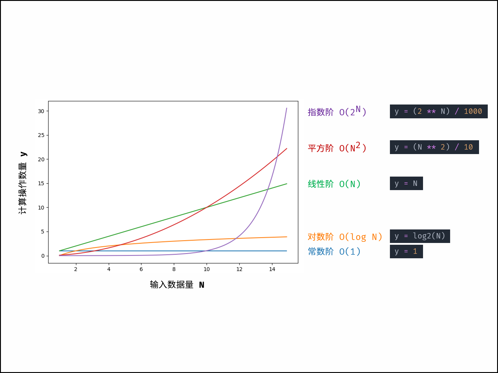

## 概念定义

根据定义，时间复杂度指输入数据大小为 NN 时，算法运行所需花费的时间。需要注意：

+ 统计的是算法的「计算操作数量」，而不是「运行的绝对时间」。计算操作数量和运行绝对时间呈正相关关系，并不相等。算法运行时间受到「编程语言 、计算机处理器速度、运行环境」等多种因素影响。例如，同样的算法使用 Python 或 C++ 实现、使用 CPU 或 GPU 、使用本地 IDE 或力扣平台提交，运行时间都不同。
+ 体现的是计算操作随数据大小 NN 变化时的变化情况。假设算法运行总共需要「 11 次操作」、「 100100 次操作」，此两情况的时间复杂度都为常数级 O(1)O(1) ；需要「 NN 次操作」、「 100N100N 次操作」的时间复杂度都为 O(N)O(N)

## 符号表示

根据输入数据的特点，时间复杂度具有「最差」、「平均」、「最佳」三种情况，分别使用 OO , \ThetaΘ , \OmegaΩ 三种符号表示。以下借助一个查找算法的示例题目帮助理解。

> **题目：** 输入长度为 NN 的整数数组 nums ，判断此数组中是否有数字 77 ，若有则返回 true ，否则返回 falsefalse 。
>
> **解题算法：** 线性查找，即遍历整个数组，遇到 77 则返回 true 。
>
> **代码：**
>
> ```java
> boolean findSeven(int[] nums) {
>     for (int num : nums) {
>         if (num == 7)
>             return true;
>     }
>     return false;
> }
> ```

+ 最佳情况 \Omega(1)Ω(1) ： nums = [7, a, b, c, ...] ，即当数组首个数字为 77 时，无论 nums 有多少元素，线性查找的循环次数都为 11 次；
+ 最差情况 O(N)O(N) ： nums = [a, b, c, ...] 且 nums 中所有数字都不为 77 ，此时线性查找会遍历整个数组，循环 NN 次；
+ **平均情况 \ThetaΘ ：** 需要考虑输入数据的分布情况，计算所有数据情况下的平均时间复杂度；例如本题目，需要考虑数组长度、数组元素的取值范围等；

> 大 *O* 是最常使用的时间复杂度评价渐进符号，下文示例与本 LeetBook 题目解析皆使用 *O* 。

### 常见种类

根据从小到大排列，常见的算法时间复杂度主要有：

*O*(1)<*O*(log*N*)<*O*(*N*)<*O*(*N*log*N*)<*O*(*N*2)<*O*(2*N*)<*O*(*N*!)


